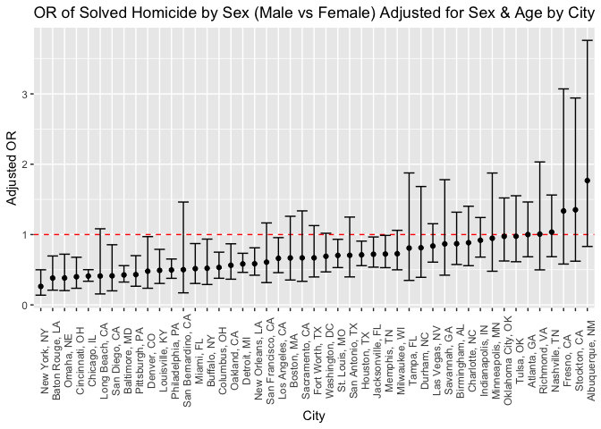

p8105_hw6_rh3064.Rmd
================
Rahul Hosalli
2022-12-04

### Dependencies

## Problem 2

The data is loaded and a `city_check()` function is created to check
cities and states in the dataset.

``` r
url = "https://raw.githubusercontent.com/washingtonpost/data-homicides/cbcb572ed1a3c3f10d6dfe07e84464a28986173e/homicide-data.csv"
wphom_df <- read_csv(url)
```

    ## Rows: 52179 Columns: 12
    ## ── Column specification ────────────────────────────────────────────────────────
    ## Delimiter: ","
    ## chr (9): uid, victim_last, victim_first, victim_race, victim_age, victim_sex...
    ## dbl (3): reported_date, lat, lon
    ## 
    ## ℹ Use `spec()` to retrieve the full column specification for this data.
    ## ℹ Specify the column types or set `show_col_types = FALSE` to quiet this message.

``` r
city_check <- function(df){
  df_sum <- df %>% 
    group_by(state) %>% 
    count(city)
  
  df_sum %>% 
    knitr::kable()
}


city_check(wphom_df)
```

| state | city           |    n |
|:------|:---------------|-----:|
| AL    | Birmingham     |  800 |
| AL    | Tulsa          |    1 |
| AZ    | Phoenix        |  914 |
| CA    | Fresno         |  487 |
| CA    | Long Beach     |  378 |
| CA    | Los Angeles    | 2257 |
| CA    | Oakland        |  947 |
| CA    | Sacramento     |  376 |
| CA    | San Bernardino |  275 |
| CA    | San Diego      |  461 |
| CA    | San Francisco  |  663 |
| CA    | Stockton       |  444 |
| CO    | Denver         |  312 |
| DC    | Washington     | 1345 |
| FL    | Jacksonville   | 1168 |
| FL    | Miami          |  744 |
| FL    | Tampa          |  208 |
| GA    | Atlanta        |  973 |
| GA    | Savannah       |  246 |
| IL    | Chicago        | 5535 |
| IN    | Indianapolis   | 1322 |
| KY    | Louisville     |  576 |
| LA    | Baton Rouge    |  424 |
| LA    | New Orleans    | 1434 |
| MA    | Boston         |  614 |
| MD    | Baltimore      | 2827 |
| MI    | Detroit        | 2519 |
| MN    | Minneapolis    |  366 |
| MO    | Kansas City    | 1190 |
| MO    | St. Louis      | 1677 |
| NC    | Charlotte      |  687 |
| NC    | Durham         |  276 |
| NE    | Omaha          |  409 |
| NM    | Albuquerque    |  378 |
| NV    | Las Vegas      | 1381 |
| NY    | Buffalo        |  521 |
| NY    | New York       |  627 |
| OH    | Cincinnati     |  694 |
| OH    | Columbus       | 1084 |
| OK    | Oklahoma City  |  672 |
| OK    | Tulsa          |  583 |
| PA    | Philadelphia   | 3037 |
| PA    | Pittsburgh     |  631 |
| TN    | Memphis        | 1514 |
| TN    | Nashville      |  767 |
| TX    | Dallas         | 1567 |
| TX    | Fort Worth     |  549 |
| TX    | Houston        | 2942 |
| TX    | San Antonio    |  833 |
| VA    | Richmond       |  429 |
| wI    | Milwaukee      | 1115 |

A new city_state variable is created, and WI is correct to be uppercase.
A new binary resolved variable is created, and victim_age, victim_sex
and victim_race are coerced into the correct type. Cities that do not
report victim race are filtered out, along with victims that are neither
black nor white and victims with unknown sex. `city_check()` is used to
check if the filtering was performed correctly, along with count().

``` r
wphom_tidy <- wphom_df%>% 
  mutate(
    state = case_when(
      city == "Milwaukee" ~ "WI",
      TRUE ~ state
    ),
    
    city_state = paste(city, state, sep = ", "),
    
    resolved = as.numeric(disposition == "Closed by arrest"),
    victim_age = as.numeric(victim_age),
    victim_race = fct_relevel(victim_race, "White"),
    victim_sex = fct_relevel(victim_sex, "Female")
  )
```

    ## Warning in mask$eval_all_mutate(quo): NAs introduced by coercion

``` r
wphom_final <- wphom_tidy %>%
  filter(!city_state %in%  c("Dallas, TX", "Phoenix, AZ", 
                         "Kansas City, MO", "Tulsa, AL") &
          victim_sex %in% c("Male", "Female") & 
           victim_race %in% c("Black", "White"))

city_check(wphom_final)
```

| state | city           |    n |
|:------|:---------------|-----:|
| AL    | Birmingham     |  771 |
| CA    | Fresno         |  210 |
| CA    | Long Beach     |  186 |
| CA    | Los Angeles    | 1078 |
| CA    | Oakland        |  740 |
| CA    | Sacramento     |  235 |
| CA    | San Bernardino |  152 |
| CA    | San Diego      |  272 |
| CA    | San Francisco  |  462 |
| CA    | Stockton       |  191 |
| CO    | Denver         |  208 |
| DC    | Washington     | 1226 |
| FL    | Jacksonville   | 1138 |
| FL    | Miami          |  438 |
| FL    | Tampa          |  187 |
| GA    | Atlanta        |  945 |
| GA    | Savannah       |  231 |
| IL    | Chicago        | 4507 |
| IN    | Indianapolis   | 1237 |
| KY    | Louisville     |  550 |
| LA    | Baton Rouge    |  410 |
| LA    | New Orleans    | 1353 |
| MA    | Boston         |  487 |
| MD    | Baltimore      | 2753 |
| MI    | Detroit        | 2457 |
| MN    | Minneapolis    |  299 |
| MO    | St. Louis      | 1645 |
| NC    | Charlotte      |  584 |
| NC    | Durham         |  230 |
| NE    | Omaha          |  365 |
| NM    | Albuquerque    |  177 |
| NV    | Las Vegas      |  909 |
| NY    | Buffalo        |  479 |
| NY    | New York       |  412 |
| OH    | Cincinnati     |  679 |
| OH    | Columbus       | 1026 |
| OK    | Oklahoma City  |  522 |
| OK    | Tulsa          |  515 |
| PA    | Philadelphia   | 2615 |
| PA    | Pittsburgh     |  622 |
| TN    | Memphis        | 1421 |
| TN    | Nashville      |  746 |
| TX    | Fort Worth     |  383 |
| TX    | Houston        | 1887 |
| TX    | San Antonio    |  310 |
| VA    | Richmond       |  408 |
| WI    | Milwaukee      |  994 |

``` r
wphom_final %>%
  group_by(victim_race) %>%
  count() %>%
  knitr::kable()
```

| victim_race |     n |
|:------------|------:|
| White       |  6330 |
| Black       | 33322 |

``` r
wphom_final %>%
  group_by(victim_sex) %>%
  count() %>%
  knitr::kable()
```

| victim_sex |     n |
|:-----------|------:|
| Female     |  5903 |
| Male       | 33749 |

### Baltimore

The estimated OR and 95% confidence interval are calculated from the
estimate and standard error and extracted from the output `glm()`.

``` r
baltimore_df <- wphom_final %>%
  filter(city_state == "Baltimore, MD")

baltimore_model <- baltimore_df %>%
  glm(resolved ~ victim_age+victim_sex+victim_race, data = ., family = binomial())

balt_or <- baltimore_model %>%
  broom::tidy() %>%
  mutate(OR = exp(estimate),
         CI_lower = exp((estimate - 1.96*std.error)),
         CI_upper = exp((estimate + 1.96*std.error))
         ) %>%
  filter(term == "victim_sexMale") %>%
  select(term, OR, CI_lower, CI_upper)

balt_or %>% knitr::kable()
```

| term           |        OR | CI_lower |  CI_upper |
|:---------------|----------:|---------:|----------:|
| victim_sexMale | 0.4255117 | 0.324559 | 0.5578655 |

### All Cities

The OR and 95%CI for Baltimore, MD are calculated from the output of
`glm()`.

``` r
glm_city <- function(x){
   wphom_final %>%
    filter(city_state == x) %>%
    
    glm(resolved ~ victim_age + victim_sex + victim_race, 
        data =., 
        family = binomial()) %>%
    
    broom::tidy() %>%
    
    mutate(OR = exp(estimate),
         CI_lower = exp((estimate - 1.96*std.error)),
         CI_upper = exp((estimate + 1.96*std.error))
         ) %>%
    
    filter(term == "victim_sexMale") %>%
    
    select(OR, CI_lower, CI_upper)
}
```

A function to generalize the above model was created.

``` r
glm_homicide <- function(df){
  
  glm(resolved ~ victim_age + victim_race + victim_sex,
      data = df,
      family = binomial()) %>%
    broom::tidy() %>%
    mutate(OR = exp(estimate),
         CI_lower = exp((estimate - 1.96*std.error)),
         CI_upper = exp((estimate + 1.96*std.error))
         ) %>%
    
    filter(term == "victim_sexMale") %>%
    
    select(OR, CI_lower, CI_upper)
}
```

A new dataframe is created with `select()` and `nest()` to nest the data
per city, and mutate is used to create a new column model, which is the
above function applied to each city’s data. `unnest()` is used to return
a tidy data frame with the OR and 95% CI for each city.

``` r
wphom_city <-  wphom_final %>%
  select(city_state, victim_race:victim_sex, resolved) %>%
  nest(data=victim_race:resolved) %>%
  
  mutate(
    model = map(data, glm_homicide)
  ) %>%
  select(city_state, model) %>%
  unnest(cols = model)

wphom_city %>% knitr::kable()
```

| city_state         |        OR |  CI_lower |  CI_upper |
|:-------------------|----------:|----------:|----------:|
| Albuquerque, NM    | 1.7674995 | 0.8306583 | 3.7609380 |
| Atlanta, GA        | 1.0000771 | 0.6836012 | 1.4630669 |
| Baltimore, MD      | 0.4255117 | 0.3245590 | 0.5578655 |
| Baton Rouge, LA    | 0.3814393 | 0.2092532 | 0.6953103 |
| Birmingham, AL     | 0.8700153 | 0.5742951 | 1.3180098 |
| Boston, MA         | 0.6673219 | 0.3535003 | 1.2597401 |
| Buffalo, NY        | 0.5205704 | 0.2897705 | 0.9352008 |
| Charlotte, NC      | 0.8838976 | 0.5569929 | 1.4026659 |
| Chicago, IL        | 0.4100982 | 0.3359897 | 0.5005527 |
| Cincinnati, OH     | 0.3998277 | 0.2360847 | 0.6771390 |
| Columbus, OH       | 0.5324845 | 0.3782581 | 0.7495933 |
| Denver, CO         | 0.4790620 | 0.2364294 | 0.9706934 |
| Detroit, MI        | 0.5823472 | 0.4622017 | 0.7337235 |
| Durham, NC         | 0.8123514 | 0.3920374 | 1.6832957 |
| Fort Worth, TX     | 0.6689803 | 0.3969391 | 1.1274643 |
| Fresno, CA         | 1.3351647 | 0.5804995 | 3.0709150 |
| Houston, TX        | 0.7110264 | 0.5576715 | 0.9065526 |
| Indianapolis, IN   | 0.9187284 | 0.6794344 | 1.2423006 |
| Jacksonville, FL   | 0.7198144 | 0.5365350 | 0.9657017 |
| Las Vegas, NV      | 0.8373078 | 0.6076753 | 1.1537154 |
| Long Beach, CA     | 0.4102163 | 0.1555148 | 1.0820672 |
| Los Angeles, CA    | 0.6618816 | 0.4581299 | 0.9562510 |
| Louisville, KY     | 0.4905546 | 0.3047208 | 0.7897189 |
| Memphis, TN        | 0.7232194 | 0.5291729 | 0.9884224 |
| Miami, FL          | 0.5152379 | 0.3044831 | 0.8718716 |
| Milwaukee, WI      | 0.7271327 | 0.4987091 | 1.0601810 |
| Minneapolis, MN    | 0.9469587 | 0.4782860 | 1.8748838 |
| Nashville, TN      | 1.0342379 | 0.6847143 | 1.5621816 |
| New Orleans, LA    | 0.5849373 | 0.4217648 | 0.8112381 |
| New York, NY       | 0.2623978 | 0.1379459 | 0.4991275 |
| Oakland, CA        | 0.5630819 | 0.3650924 | 0.8684409 |
| Oklahoma City, OK  | 0.9740747 | 0.6240860 | 1.5203378 |
| Omaha, NE          | 0.3824861 | 0.2029670 | 0.7207853 |
| Philadelphia, PA   | 0.4962756 | 0.3776157 | 0.6522225 |
| Pittsburgh, PA     | 0.4307528 | 0.2650983 | 0.6999213 |
| Richmond, VA       | 1.0060520 | 0.4979508 | 2.0326120 |
| San Antonio, TX    | 0.7046200 | 0.3976578 | 1.2485342 |
| Sacramento, CA     | 0.6688418 | 0.3347139 | 1.3365127 |
| Savannah, GA       | 0.8669817 | 0.4222665 | 1.7800544 |
| San Bernardino, CA | 0.5003444 | 0.1712084 | 1.4622204 |
| San Diego, CA      | 0.4130248 | 0.1995220 | 0.8549909 |
| San Francisco, CA  | 0.6075362 | 0.3167902 | 1.1651253 |
| St. Louis, MO      | 0.7031665 | 0.5303670 | 0.9322661 |
| Stockton, CA       | 1.3517273 | 0.6211368 | 2.9416496 |
| Tampa, FL          | 0.8077029 | 0.3477529 | 1.8759988 |
| Tulsa, OK          | 0.9757694 | 0.6135882 | 1.5517343 |
| Washington, DC     | 0.6910490 | 0.4690002 | 1.0182272 |

### Plot

``` r
wphom_city %>%
  mutate(city_state = forcats::fct_reorder(city_state, OR)) %>%
  ggplot(aes(x = city_state, y = OR)) + 
    geom_hline(yintercept = 1, color = "red",
               linetype = 'dashed')+
  geom_point() +
  geom_errorbar(aes(ymin = CI_lower, ymax = CI_upper)) +
  theme(axis.text.x = element_text(angle = 90)) +
  labs(title="OR of Solved Homicide by Sex (Male vs Female) Adjusted for Sex & Age by City",
        x ="City", y = "Adjusted OR")
```

<!-- -->

Most cities have an adjusted odds ratio of solved homicide in males
vs. female \<1, which indicates that odds of a homicide being resolved
for a male victim in these cities is less than the odds of a homicide
being resolved for a female victim in these cities. No cities with an
adjusted OR greater than 1 had a 95% confidence interval that did not
include the null (i.e. OR =1), indicating that the OR is not likely to
be statistically significant. New York had the lowest OR, while
Albuquerque had the highest OR.
